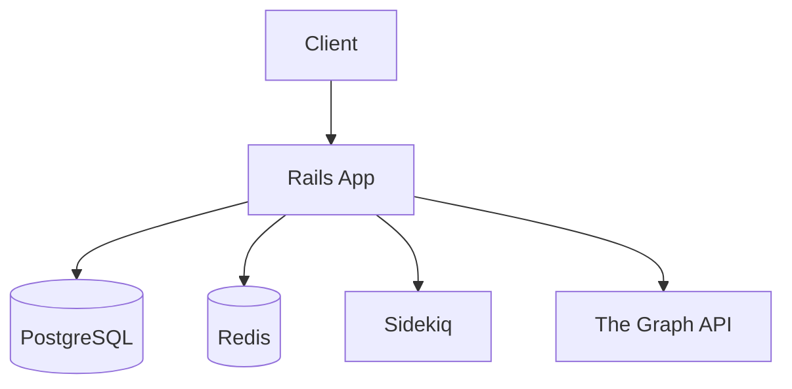
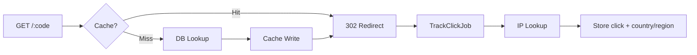
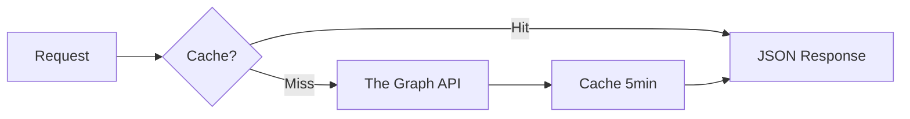

# CoinGecko URL Shortener

A production-ready URL shortener service with Extension 1 (DEX data queries), built with Rails 7, Hotwire, and Tailwind CSS.

### Transparency & Methodology

CoinGecko required this assessment in Ruby on Rails. My expertise is in Go, Node.js, and TypeScript. Rather than cram Rails syntax under time pressure, I treated the exercise as an **architectural design challenge**: I owned the system design, database schema, design patterns, and edge cases, and used AI strictly as a **syntax translator** to produce idiomatic Rails code. This approach was cleared in advance with HR. The outcome is a production-ready app in your native stack—demonstrating rapid adaptability, system design depth, and execution over syntax memorization.

## Features

### Core URL Shortener
- 🔗 **Short URL Generation**: Base62-encoded short codes (7 chars, supports 3.5T URLs)
- 📊 **Analytics**: Click tracking with geolocation, timestamps, and referrer data
- ⚡ **High Performance**: Redis caching with 5min TTL, async click tracking via Sidekiq
- 🔒 **Security**: SSRF protection, rate limiting, XSS prevention
- 🎨 **Modern UI**: Hotwire (Turbo + Stimulus) with Tailwind CSS

### Extension 1: Querying DEX Data

I implemented Extension 1 as a **Rails API**, not a one-off GraphQL script: a dedicated endpoint backed by a Service/Query Object, a **5-minute Redis cache** to handle high-concurrency reads and protect The Graph from thundering herds, and **financial fields returned as strings** (BigDecimal / PostgreSQL `NUMERIC`) to avoid floating-point errors. That reflects a production-reliability mindset—optimized for your stack and safe for financial data.

**Deliverables:**

- 📄 **Schema**: Uniswap V3 subgraph schema (introspection) in `extensions/1-schema.graphql`
- 🔗 **cURL Queries**: Three queries (100 pools; 100 pools high liquidity past week; USDC/WETH pool) in `extensions/1-query-*.curl`
- 📦 **Optional**: Postman collection in `extensions/1-postman-collection.json`
- 🔑 **API Key**: Get a key from [The Graph Studio](https://thegraph.com/studio/apikeys/) and substitute `YOUR_API_KEY` in the cURL files or collection

#### Rails API (Proof of Work)

The same DEX data is exposed via `GET /api/dex/pools` and `GET /api/dex/pools/:id`. The controller delegates to a Service Object, reads through a 5-minute Redis cache, and returns pool data with monetary fields as strings (BigDecimal-safe).

1. Set the API key (required for the DEX endpoints):
   ```bash
   export THE_GRAPH_API_KEY=your_key_from_thegraph_studio
   ```

2. **List 100 pools** (Extension 1 Q2):
   ```bash
   curl -s "http://localhost:3000/api/dex/pools" | jq .
   ```

3. **List 100 pools with highest liquidity created in the past week** (Q3). Use a Unix timestamp for “one week ago”:
   ```bash
   CREATED_SINCE=$(date -v-7d +%s)   # macOS
   # CREATED_SINCE=$(date -d '7 days ago' +%s)   # Linux
   curl -s "http://localhost:3000/api/dex/pools?order_by=total_value_locked_usd&created_since=${CREATED_SINCE}" | jq .
   ```

4. **Single pool by id** (USDC/WETH pool, Q4):
   ```bash
   curl -s "http://localhost:3000/api/dex/pools/0x8ad599c3a0ff1de082011efddc58f1908eb6e6d8" | jq .
   ```

**Sample JSON response** (single pool, truncated). Financial fields are strings for precision:

```json
{
  "data": {
    "pool": {
      "id": "0x8ad599c3a0ff1de082011efddc58f1908eb6e6d8",
      "token0": { "id": "...", "symbol": "USDC", "derivedETH": "0.0005..." },
      "token1": { "id": "...", "symbol": "WETH", "derivedETH": "1.0" },
      "liquidity": "123456789",
      "token0Price": "2000.5",
      "token1Price": "0.0005",
      "volumeUSD": "1000000.25",
      "totalValueLockedUSD": "5000000.75"
    }
  }
}
```

## Tech Stack

| Layer | Technology | Purpose |
|-------|-----------|---------|
| Framework | Rails 7.2.3 | Backend framework |
| Language | Ruby 3.2.7 | Programming language |
| Database | PostgreSQL 14+ | Primary datastore |
| Cache/Queue | Redis | Caching & background jobs |
| Background Jobs | Sidekiq | Async processing |
| Frontend | Hotwire (Turbo + Stimulus) | Interactive UI without heavy JavaScript |
| CSS | Tailwind CSS | Utility-first styling |
| HTTP Client | HTTParty | External API integration |
| Testing | RSpec + Capybara | Unit & integration tests |

### Mapping: Go / Node → Rails (Rosetta Stone)

This stack was chosen to mirror CoinGecko’s internal environment (Dokku/Heroku, Sidekiq, Hotwire, RSpec, Brakeman, RuboCop). The table below maps my skillset (Go, Node.js, TypeScript, PostgreSQL, Redis, RabbitMQ, REST/gRPC, CI/CD) to the Rails equivalents in this project:

| My skillset (Go / Node) | This project (Rails) |
|--------------------------|----------------------|
| Async processing (RabbitMQ, Go routines) | Sidekiq + Redis |
| Business logic (Clean Architecture, use cases) | Rails Service Objects |
| UI updates (React, Next.js) | Hotwire (Turbo + Stimulus) |
| REST APIs, rate limiting | Rack::Attack, JSON API controllers |
| Relational store + caching | PostgreSQL + Redis (TTL) |

### File Structure

```
app/
├── controllers/          # Request handling
│   ├── api/              # JSON API endpoints
│   ├── short_urls_controller.rb
│   └── redirects_controller.rb
├── services/             # Business logic
│   └── short_urls/
├── queries/              # Complex database queries
├── values/               # Domain value objects
├── decorators/           # Presentation logic
├── jobs/                 # Background jobs (Sidekiq)
└── views/                # Hotwire templates
```

### Documentation

Design notes and decisions live in [docs/](docs/):

- **ADRs** (Architecture Decision Records): [docs/adr/](docs/adr/) — short-code strategy, modular monolith, rate limiting
- **Wiki**: [docs/wiki/](docs/wiki/) — short URL strategy and implementation notes

## Architecture



## Request flows

**Create short URL:** Submit URL → validate (SSRF check) → store in DB → return short URL.

**Redirect (GET /:code):**



**Extension 1 (DEX pools):**



File deliverables (schema, cURLs, optional Postman collection) live in [extensions/](extensions/).

## Deployed Application

**URL:** https://herokuapp.com

## Installation

### Prerequisites

- Ruby 3.2.7 (managed via rbenv)
- PostgreSQL 14+
- Redis
- Bundler

### Setup

```bash
# 1. Install Ruby 3.2.7 (if not already installed)
rbenv install 3.2.7
rbenv local 3.2.7

# 2. Install dependencies
bundle install

# 3. Set up database
bin/rails db:create db:migrate

# 4. Start Redis (required for caching and Sidekiq)
redis-server --daemonize yes
# OR: brew services start redis

# 5. Start the application
bin/dev  # Starts web server, CSS compiler, and Sidekiq

# Application will be available at:
# http://localhost:3000
```

### Optional: IP geolocation for click reports

The usage report shows country and city for each click when IP2Location data is loaded. Without this step, country and city remain nil but the app and report still work.

You can use either the **CSV** or the **zip** (no need to unzip manually).

1. Download [IP2Location LITE DB3](https://lite.ip2location.com/database/ip-country-region-city) (CSV or zip).
2. Place the file at the project root as `IP2LOCATION-LITE-DB3.CSV` or `IP2LOCATION-LITE-DB3.zip`, or pass the path when running the task.
3. Run: `bin/rails ip_geo:import` (or `bin/rails ip_geo:import[/path/to/file.csv]` or `bin/rails ip_geo:import[/path/to/file.zip]`).

Alternatively, after `bin/rails db:migrate`, run `bin/rails db:seed`. If the zip or CSV is present at the default location (or set `IP_GEO_FILE` or `IP_GEO_ZIP` to the file path), seed will load the data so the feature is ready.

This imports ~3M rows into `ip_geo_ranges`; re-run to replace data. On Heroku (10K row limit), set `IP_GEO_IMPORT_LIMIT=1000` so only the first 1k rows are imported (e.g. `heroku config:set IP_GEO_IMPORT_LIMIT=1000` before running the import or `db:seed`).

## API Endpoints

### URL Shortener

#### Create Short URL
```bash
POST /api/shorten
Content-Type: application/json

{
  "target_url": "https://www.coingecko.com/en/coins/bitcoin"
}

# Response:
{
  "data": {
    "short_url": "http://localhost:3000/abc123",
    "short_code": "abc123",
    "target_url": "https://www.coingecko.com/en/coins/bitcoin",
    "title": "Bitcoin Price, Charts, and News | CoinGecko",
    "created_at": "2026-02-16T12:00:00Z"
  }
}
```

#### Redirect to Target URL
```bash
GET /:short_code
# Returns 302 redirect to target URL
# Tracks click event asynchronously
```

#### Get URL Statistics
```bash
GET /api/stats/:short_code

# Response:
{
  "data": {
    "short_code": "abc123",
    "target_url": "https://www.coingecko.com",
    "click_count": 42,
    "created_at": "2026-02-16T12:00:00Z",
    "clicks_by_country": {
      "US": 20,
      "SG": 15,
      "JP": 7
    },
    "recent_clicks": [
      {
        "country": "US",
        "city": "New York",
        "clicked_at": "2026-02-16T14:30:00Z"
      }
    ]
  }
}
```

#### Get Usage Report
```bash
GET /api/report?limit=100&since=2026-02-01

# Response: Array of short URL stats
```

### Extension 1: DEX Data (Uniswap V3 GraphQL)

**Rails API:** The app exposes DEX data at `GET /api/dex/pools` and `GET /api/dex/pools/:id` (see [Rails API (Proof of Work)](#rails-api-proof-of-work) above for `THE_GRAPH_API_KEY`, curl examples, and sample JSON).

**File deliverables** (for submission): Use your API client or cURL with the Uniswap V3 subgraph:

- **Endpoint:** `https://gateway.thegraph.com/api/<YOUR_API_KEY>/subgraphs/id/5zvR82QoaXYFyDEKLZ9t6v9adgnptxYpKpSbxtgVENFV`
- **API key:** Get one at [The Graph Studio](https://thegraph.com/studio/apikeys/) (connect wallet; no funds required).

| Deliverable | File |
|-------------|------|
| Schema (Q1) | `extensions/1-schema.graphql` |
| cURL Q2 – 100 pools | `extensions/1-query-2-100-pools.curl` |
| cURL Q3 – 100 pools, high liquidity, past week | `extensions/1-query-3-100-pools-high-liquidity-past-week.curl` |
| cURL Q4 – USDC/WETH pool | `extensions/1-query-4-usdc-weth-pool.curl` |
| Optional collection | `extensions/1-postman-collection.json` |

Replace `YOUR_API_KEY` in each cURL file (or set the `api_key` variable in Postman) before running.

## Rate Limits

- URL Shortening: 10 requests/minute per IP
- Redirects: 100 requests/minute per IP

## Testing

```bash
# Run all tests
bundle exec rspec

# Run specific test file
bundle exec rspec spec/services/short_urls/creator_service_spec.rb

# Run with coverage
COVERAGE=true bundle exec rspec
```

## Development

### Running Components Individually

```bash
# Web server only
bin/rails server

# Sidekiq worker only
bundle exec sidekiq

# Tailwind CSS watch mode
bin/rails tailwindcss:watch

# Rails console
bin/rails console

# Dev mode
bin/dev
```

### Database Management

```bash
# Create database
bin/rails db:create

# Run migrations
bin/rails db:migrate

# Rollback last migration
bin/rails db:rollback

# Seed for IP location
bin/rails db:seed

# Reset database (drop, create, migrate, seed)
bin/rails db:reset

# Check migration status
bin/rails db:migrate:status
```